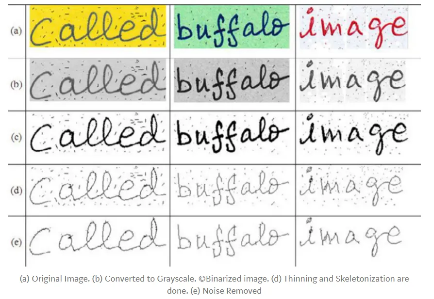

# Pre-processing images

Pre-processing is one of the 2 critical phases for OCR systems. Some of the most basic and important pre-processing techniques are:

- Binarization
- Skew Correction
- Noise removal
- Thinning and skeletonization

Before discussing how these techniques are applied, we need to understand how an OCR system works. An image is a multidimensional array (2D if the image is grayscale or binary, 3D if it is coloured). Each cell in the array is called a pixel and can store 8-bit integer which means the pixel range is 0-255.


## Binarization

Binarization is the process of converting a coloured image into an image which consists of only black and white pixels (Black pixel value = 0 | White pixel value = 255). For this we need to set a _threshold_ value (normally 127).

The cons of this method is when the image has noise on it, for example when lighting is not uniform. This will cause this method to fail and lose important information.


### Local Maxima and Minima Method

This is a method to determine the _threshold_ for the binarization.


_C(i,j)_ is the _threshold_ for a _defined size_ of locality in an image, for example a 10x10 size part. By defining different _thresholds_ we will prevent this _noise conditions_ and adjust to each condition. Anyway the transition may be not that smooth on each case.

### Otsu's Binarization

This method gives a unique _threshold_ for the whole image considering characteristis such as lighting, contrast, sharpness, etc.

This can be accomplished using OpenCV python:

```python
ret, imgf = cv2.threshold(img, 0, 255,cv2.THRESH_BINARY,cv2.THRESH_OTSU) #imgf contains Binary image
```

### Adaptative Thresholding

This method gives a _threshold_ for a small part of the image depending on the characteristics of its locality and neighbours. This gives a smoother transition to the binarization.

It can be done using OpenCV python:

```python
imgf = cv2.adaptiveThreshold(img,255,cv2.ADAPTIVE_THRESH_GAUSSIAN_C,cv2.THRESH_BINARY,11,2) #imgf contains Binary image
```

## Skew Correction

While scanning a document, it might be slightly skewed (image aligned at a certain angle with horizontal). While extracting information it is important to detect and solve this skew issue.

There are several techniques that can be used for skew correction:

- Projection profile method (simplest, easiest and most widely used)
- Hough transformation method
- Topline method
- Scanline method

In this method we will use the following process:

- Project the image horizontally (taking the sum of pixel along rows of the image matrix)
- Now the image is rotated at various angles (at a small inverval of anlges called _Delta_) and the difference between the peaks will be calculated. The angle at which the **maximum** difference between peaks is found will be the _Skew angle_ for the image.
- We can correct the skewness by rotating the image through an angle equal to the skew angle in the **opposite direction** of skew.

## Noise removal

The main objective of the _Noise Removal_ stage is to smoothen the image by removing small dots/patches which have higher intensity than the rest of the image.

To find more information about _Noise Removal_ check this [article](https://towardsdatascience.com/image-filters-in-python-26ee938e57d2).

## Thinning and Skeletonization

Depending on the context in which the OCR is being used we have 2 cases:

- No need to apply _Thinning and Skeletonization_ if the text to recognize is printed text. The text has uniform width.
- Need to apply _Thinning and Skeletonization_ if the text is handwritten. Each letter may have different widht and sizes.

## Conclusions

After making all these steps we will obtain the following results:

