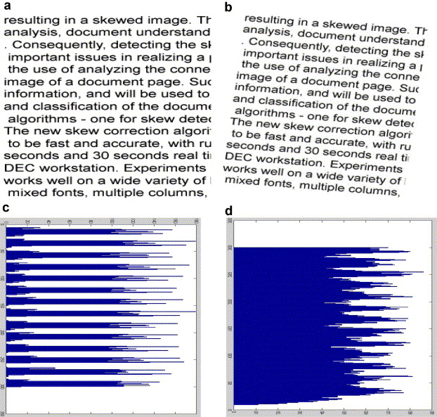

# Skew Detection for Document

The most frequently skew detection techniques are:

- Projection Profile Analysis (PP)
- Hough Transform (HT)
- Nearest Neighbour (NN)

We will be discussing the weakness and strengths of each technique and compare the performance of these methods in terms of speed and accuracy.

Skew detection is an important step in the document image analysis and understanding for optical character recognition system. The skew in images can be classified into three different types:

- _Global skew_: the document have common degree and angle orientation
- _Multiple skew_: the document have different skew angle
- _Non-uniform text line skew_: when single line on the document has different angles, line took a wavy shape

## Projection Profile Analysis (PP)

Is a process that converts a binary image into one-dimensional array (projection profile). Horizonta projection profile represented by lines is equal to number of line on document, where each line in projection profile has a value that represents a number of black pixels in the corresponding row of the image.
For the documents with skewed angle zero, the horizontal projection profile has valleys that corresponds with the space between the lines and the height of maximum peak equal to heights text lines in images. Therefore, Post (proposer of the technique) proposed a method that calculates the variation in projection profile at a number of different angles the skew angle is equal to angle that have the most variation.

Project profile methods are straightforward solution. On the other hand, it has its limitations where the main one is computational cost is high and the efficiency is not good in case of iterative process. These methods are very sensitive to noise.

## Hough Transform (HT)

# Papers about Skew Detection

[A Fast High Precision Algorithm for the Estimation of Skew Angle Using Moments](https://cgi.di.uoa.gr/~gkapog/A%20Fast%20High%20Precision%20Algorithm%20for%20the%20Estimation%20of%20Skew%20Angle%20Using%20Moments.pdf)
